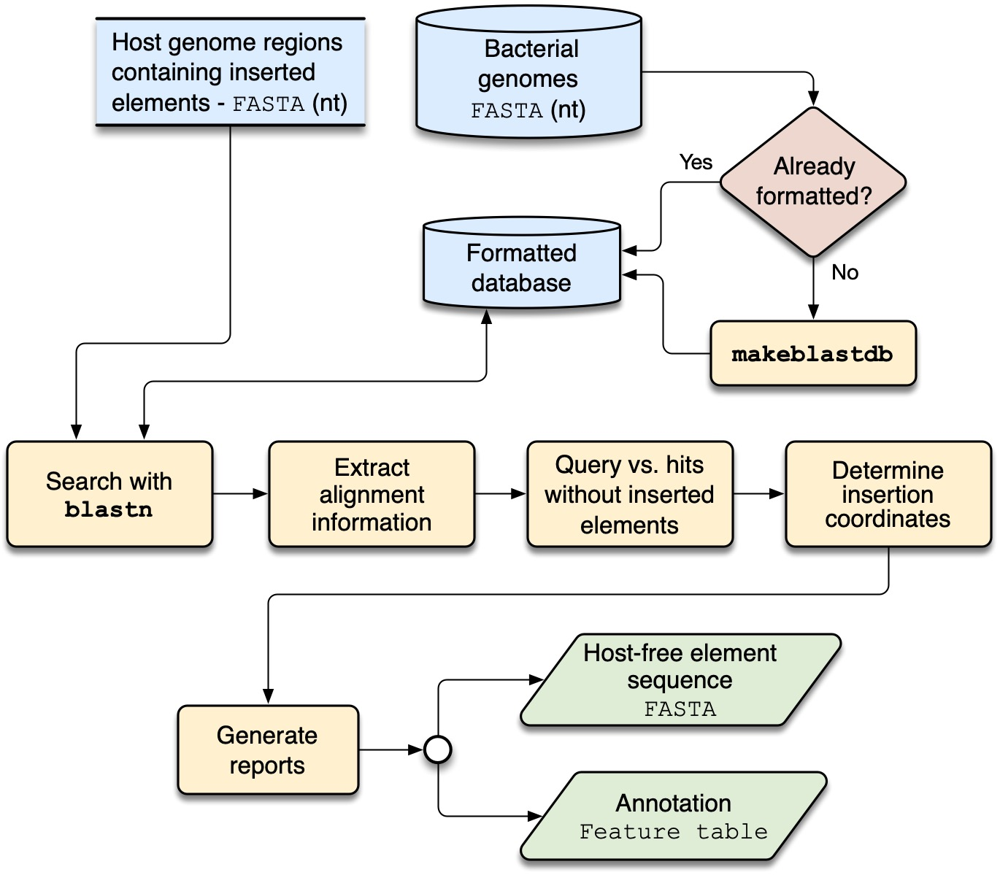

# smith_sa - Sequence Mapper for Insertion boundaries in Target Hosts – Sequence Alignment

smith_sa is a tool used for the precise determination of element insertion sites in host genomes via sequence alignments.



##   Instalation

The program consists of a single executable file and does not require any formal installation procedure.

## Requirements
 - Operating System: POSIX-compliant operating systems, such as UNIX and Linux distributions.

- Dependencies: Requires an installed Python 3 interpreter, the BLASTN and makeblastdb applications from the BLAST package, and the SeqIO module from the Bio.Python library.

## Usage
```
python smith_sa.py -q <query file> -run 'local' -d <database file> 
python smith_sa.py -q <query file> -run 'web'
python smith_sa.py -q <query file> -run 'local' -d <database file> -tab <BLASTn table file>
python smith_sa.py -q <query file> -tab <BLASTn table file> 
```

### Mandatory Parameters
These parameters must be specified in the command line:
```
-q <file name>      The DNA sequence containing the inserted element.
-d <file name>      The BLAST database (note      this is only valid when using -run local).
-run <local|remote>      Specifies whether the BLAST search should run locally or remotely.
```

### Optional Parameters
```
-cpu <integer>      Number of threads to execute the local BLASTN search (default: half of the total number of processors on the local machine).
-color <RGB number codes>      The color of the element used as a qualifier in the annotation feature table. Defined using RGB codes from 0-255 separated by commas (default: 255,0,0).
-enddist <integer>      Maximum allowed distance (in base pairs) between the 5′ or 3′ end of an alignment block and the query terminus (default: 50).
-minlen <integer>      Minimum accepted length of the element in base pairs (default: 4000).
-maxlen <integer>      Maximum accepted length of the element in base pairs (default: 50000).
-mincov <integer>      Minimum percentage query coverage per subject (default: 30).
-maxcov <integer>      Maximum percentage query coverage per subject (default: 90).
-max_remote_proc <integer>      Maximum number of BLAST processes on a remote server (default: 1).
-max_batch_size <integer>      Maximum length of concatenated query sequences per batch for remote BLAST searches, used to prevent server overloading (default: 1,000,000).
-org <Taxonomy identifier>      TaxID(s) used to restrict the database for remote BLASTN searches (e.g., -org 2,2157 for Bacteria and Archaea).
-out <name>      Output directory name (default: output_dir1).
-tab <filename>      Filename of a previous result of a BLASTN search.
```

## Contact

To report bugs, to ask for help and to give any feedback, please contact Arthur Gruber (argruber@usp.br) or Giuliana L. Pola (giulianapola@usp.br).